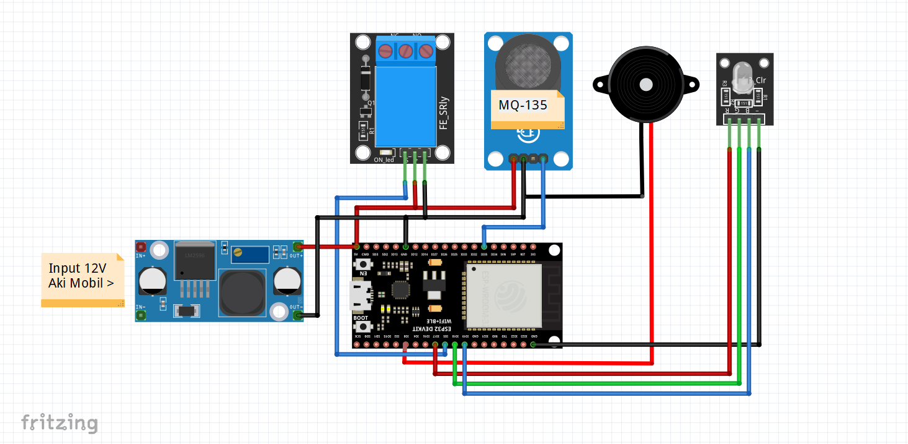

# CarAir Sentinel
## About
  Development of IoT-Based Air Quality Monitoring Tools in Cars to Prevent Gas Poisoning and Oxygen Deficiency.
## Materials
  1. The main materials
     * ESP32.
     * MQ135 sensor. 
     * Relay 1 chanel.
     * LED RGB Module.
     * Buzzer.
     * Stepdown DC (optional for prototype).
  2. Supporting materials
     * Box Casing.
## Wirring diagram
  
## Galery
  Coming soon...
## Demo Video
  Coming soon...
## Reference
